### 1.agent：代理人

### 2.hook：钩子

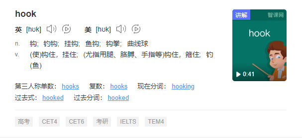

### 3.implies：暗示

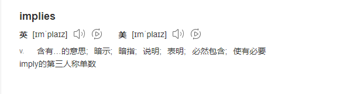

### 4.expectations：期望

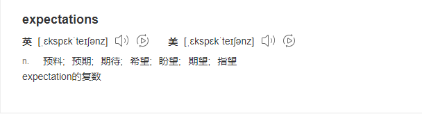

### 5.render：渲染 

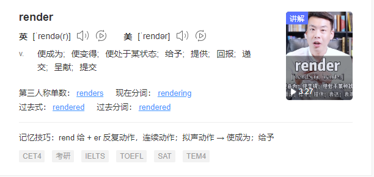

### 6.pipeline：管道

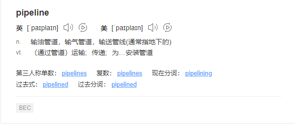

### 7.analysis：分析

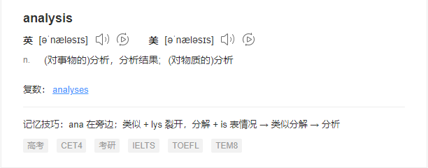

### 8.repository：存储库

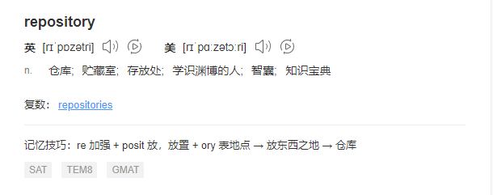

### 9.malformed：格式不正确

### 10.encapsulate：封装

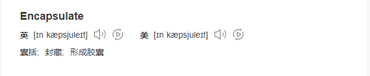

### 11.decompose：分解

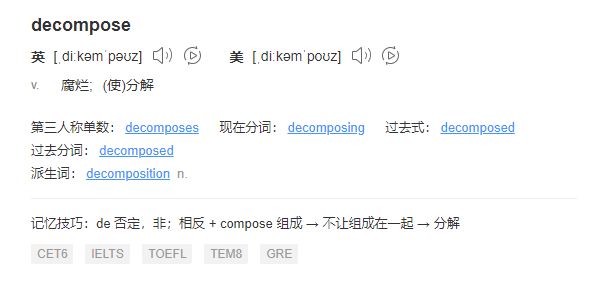

### 12.consolidate：合并

### 13.polymorphism：多态

### 14.prevent：禁止

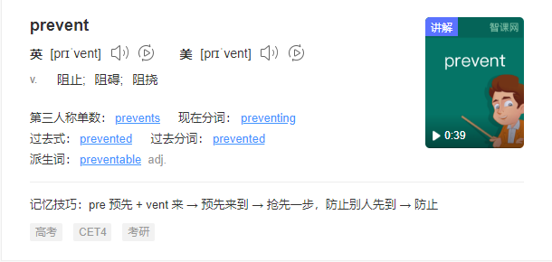

### 15.separate：分开

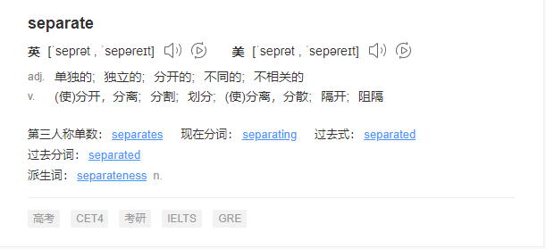

### 16.explicit：明确的

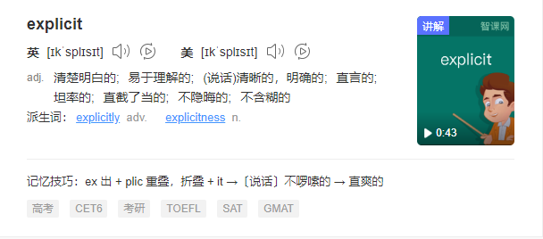

### 17.composite：混合的；

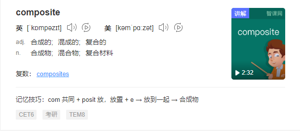

### 18.collapse：崩溃

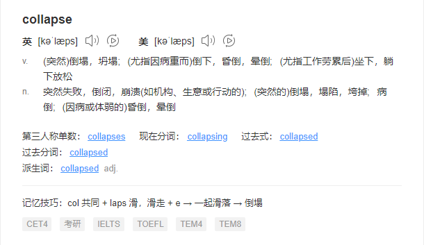

### 19.hierarchy：层次

### 20.delegation：委托

### 21.inheritance：继承

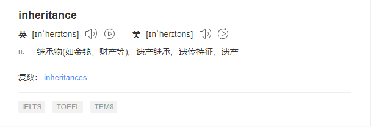

### 22.tease：戏弄

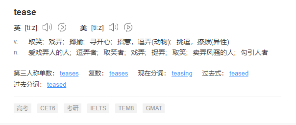

### 23.Apart：分开

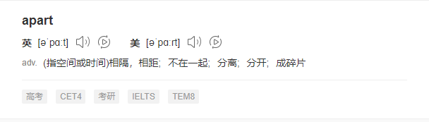

### 24.presentation：演示

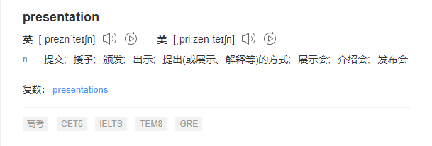