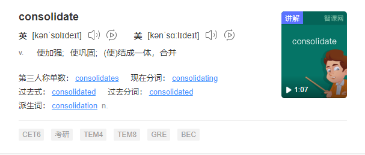

### 1.agent：代理人

### 2.hook：钩子

### 3.implies：暗示

### 4.expectations：期望

### 5.render：渲染 

### 6.pipeline：管道

### 7.analysis：分析

### 8.repository：存储库

### 9.malformed：格式不正确

### 10.encapsulate：封装

### 11.decompose：分解

### 12.consolidate：合并

### 13.polymorphism：多态

### 14.prevent：禁止

### 15.separate：分开

### 16.explicit：明确的

### 17.composite：混合的；

### 18.collapse：崩溃

### 19.hierarchy：层次

### 20.delegation：委托

### 21.inheritance：继承

### 22.tease：戏弄

### 23.Apart：分开

### 24.presentation：演示

