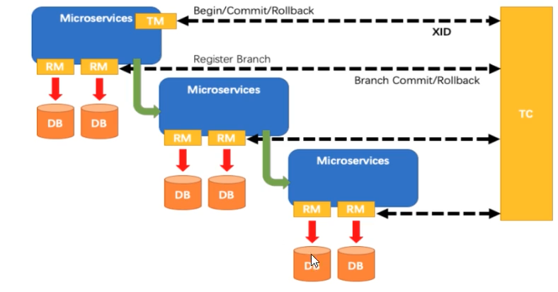

# 1.微服务架构编码构建

## 1.1 零基础微服务架构理论日门

## 1.2 第二季Boot和Cloud版本选型

## 1.3 Cloud组件停更说明

## 1.4 父工程Project空间新建

## 1.5 父工程pom文件

## 1.6 复习DependencyManagement和Dependencies

## 1.7 支付模块构建上

## 1.8 支付模块构建中

## 1.9 支付模块构建下

## 1.10 热部署Devtools

## 1.11 消费者订单模块上

## 1.12 消费者订单模块下

## 1.13 工程重构

# 2.Eureka服务注册与发现

## 2.1 Eureka基础知识

+ 什么是服务治理
+ 什么是服务注册
+ Eureka两组件

## 2.2 EurekaServer服务端安装

## 2.3 支付微服务8001入驻进eurekaServer

## 2.4 订单微服务80入驻进eurekaServer

## 2.5 Eureka集群原理说明

​	互相注册，相互守望

## 2.6 Eureka集群环境构建

## 2.7 订单支付两微服务注册进Eureka集群

## 2.8 支付微服务集群配置

## 2.9 actuator微服务信息完善

## 2.10 服务发现Discovery

## 2.11 Eureka自我保护理论知识

## 2.12 怎么禁止自我保护

# 3.Zookeeper服务注册与发现

## 3.1 支付服务注册进zookeeper

## 3.2 临时还是持久化节点

​	临时节点

## 3.3 订单服务注册进zookeeper

#  4.Consul服务注册与发现

## 4.1 Consul简介

## 4.2 安装并运行

## 4.3 服务提供者注册进Consul

## 4.4 服务消费者注册进Consul

## 4.5  三个注册中心异同点

# 5.Ribbon负载均衡服务调用

## 5.1 Ribbon入门介绍

### 5.1.1 能干嘛

1.LB(负载均衡)

+ 集中式LB：即在服务的消费方和提供方之间使用独立的LB设施(可以是硬件，如F5，也可以是软件，如nginx)，由该设施负责把访问请求通过某种策略转发至服务的提供方；
+ 进程内LB：将LB逻辑集成到消费方，消费方从服务注册中心获知有哪些地址可用，然后自己再从这些地址中选择出一个合适的服务器。Ribbon就属于进程内LB，它只是一个类库，集成于消费方进程，消费方通过它来获取到服务提供方的地址。

2.LB是什么：简单来说就是将用户的请求平摊的分配到多个服务上，从而达到系统的HA(高可用)；常见的负载均衡有软件Nginx、LVS、硬件有F5等。

3.Bibbon本地负载均衡客户端 VS Nginx服务端负载均衡区别：

+ Nginx是服务器负载均衡，客户端所有请求都会交给nginx，然后由nginx实现转发请求。即负载均衡是由服务端实现的；
+ Ribbon本地负载均衡，在调用微服务接口的时候，会在注册中心上获取注册信息服务列表之后缓存到JVM本地，从而在本地实现RPC远程服务调用技术；

## 5.2 Ribbon的负载均衡和Rest调用

​	架构说明：总结，Ribbon其实就是一个软负载均衡的客户端组件，可以和其他所需请求的客户端结合使用，和eureka结合只是其中的一个实例。

## 5.3 Ribbon默认自带的负载规则

## 5.4 Ribbon负载规则替换

## 5.5 Ribbon默认负载轮询算法原理

## 5.6 RoundRobbinRule源码分析

## 5.7 Ribbon之手写轮询算法

# 6.OpenFeign服务接口调用

## 6.1 OpenFeign是什么

​	feign是一个申明式的web服务客户端，让编写web服务客户端变得非常容易，只需创建一个接口并在接口上添加注解即可。

### 6.1.1 Feign能干什么

​	Feign旨在使编写Java Http客户端变得更容易。

​	前者在使用Ribbon+RestTemplate时，利用TestTemplate对http请求的封装处理，形成了一套模板化的调用方法，但是在实际开发汇总，由于对服务依赖的调用可能不止一处，往往一个接口会被多处调用，所以通常都会针对给个微服务自动封装一些客户端类来包装这些依赖服务的调用。所以Feign在此基础上做了进一步封装，有它来帮助我们定义和实现依赖服务接口的定义。在Feign的实现下，我们只需创建一个接口并使用注解的方式来配置它(以前是Dao接口上标注Mapper注解，现在是一个微服务接口上面标注一个Feign注解即可)，即可完成对服务提供方的接口绑定，简化了使用Springcloud Ribbon时，自动封装服务调用客户端的开发量。

### 6.1.2 Feign继承了Ribbon

​	利用Ribbon维护了Payment的服务列表信息，并且通过轮询实现了客户端的负载均衡，而与Ribbon不同的是，通过feign只需要定义服务绑定接口且以声明式的方法，优化而简单的实现了服务调用。

## 6.2 OpenFeign服务调用

## 6.3 Openfeign超时控制

​	Feign默认客户端只等待一秒钟，但是服务端处理需要超过一秒钟，导致feign客户端不想等待了，直接返回报错，为了避免这样的情况，有时候我们需要设置Feign客户端的超时控制。

​	在yml文件中开启配置。

## 6.4 OpenFeign日志增强

# 7.Hystrix断路器

## 7.1 Hystrix是什么

​	Hystrix是一个用于处理分布式系统的延迟和容错的开源库，在分布式系统里，很多依赖不可避免的会调用失败，比如超时、异常等，Hystrix能够保证在一个依赖出问题的情况下，不会导致整个服务失败，避免级联故障，以提高分布式系统的弹性。

​	"断路器"本身是一种开关装置，当某个服务单元发生故障之后，通过断路器的故障监控(类似熔断保险丝)，向调用方返回一个符合预期的、可处理的备选响应(FallBack)，而不是长时间的等待或者抛出调用方法无法处理的异常，这样就保证了服务调用方的线程不会被长时间、不必要地占用，从而避免了故障在分布式系统中的蔓延，乃至雪崩。

## 7.2 Hystrix能干吗

+   服务降级
+   服务熔断
+   接近实时的监控

## 7.3 Hystrix的服务降级熔断限流概念初讲

### 7.3.1 服务降级

​	服务器忙，请稍后再试，不让客户端等待并立刻返回一个友好提示，fallback。

​	那些情况会触发降低：程序运行异常、超时、服务熔断触发服务降级、线程池/信号量打满也会导致服务降级。

### 7.3.2 服务熔断

​	类比保险丝达到最大服务访问后，直接拒绝访问，拉闸限电，然后调用服务降级的方法并返回友好提示。

​	就是保险丝；服务降级--->进而熔断--->恢复调用链路。

### 7.3.3 服务限流

​	秒杀高并发等操作操作，严禁一窝蜂的过来拥挤，大家排队，一秒钟N个，有序进行。

## 7.4 Hystrix支付微服务构建

## 7.5 JMeter高并发压测后卡顿

## 7.6 订单微服务调用支付服务出现卡顿

 ## 7.7 降级容错解决的维度要求

## 7.8 服务降级

​	降低配置：@HystrixCommand，一旦调用服务方法失败并抛出了错误信息后，会自动调用@HystrixCommand标注好的fallbackMethod调用类中的指定方法。

### 7.8.1 Hystrix之全局服务降级DefaultProperties

### 7.8.2 Hystrix之通配服务降级FeignFallback

## 7.9 服务熔断

 	熔断机制是应对雪崩效应的一种服务链路保护机制，当扇出链路的某个微服务出错不可用或者响应时间太长时，会进行服务的降级，进而熔断该节点微服务的调用，快速返回错误的响应信息。当检测到该节点微服务调用响应正常后，恢复调用链路。

​	在SpringCloud框架里，熔断机制通过Hystrix实现，Hystrix会监控微服务间调用的状况，当失败的调用到一定的阈值，缺省是5秒内20次调用失败，就会启动熔断机制。熔断机制的注解是@HystrixCommand。

## 7.10 服务限流

# 8 Gateway新一代网关

## 8.1 GateWay概念

### 8.1.1 GateWay是什么

​	核心逻辑：路由转发+执行过滤器链。

​	SpringCloud GateWay作为Spring Cloud生态系统中的网关，目标是替代Zuul，在Spring Cloud 2.0以上版本中，没有对新版本的Zuul 2.0以上最新高性能版本进行集成，任然还是使用的Zuul 1.x非Reactor模式的老版本。而为了提升网关的性能，SpringCloud GateWay是基于WebFlux框架实现的，而WebFlux框架的底层则使用了高性能的Reactor模式通信框架Netty。

​	Spring Cloud GateWay的目标提供统一的路由方式且基于Fiter链的方式提供了网关的基本的功能，例如：安全、监控/指标和限流。

​	总之一句话：SpringCloud GateWay使用了Webflux中的reactor-netty响应式编程组件，底层使用了Netty通讯框架。

​	网关在框架中的位置：

### 8.1.2 GateWay非阻塞异步模型

​	Springcloud中所集成的Zuul版本，采用的是Tomcat容器，使用的是传统的Servlet IO处理模型。

​	上述模式的缺点：servlet是一个简单的网络IO模型，当请求进入servlet container时，servlet container就会为其绑定一个线程，在并发不高的场景下这种模型是适用的，但是一旦高并发，线程数据就会上涨，而线程资源代价是昂贵的(上下文切换，内存消耗大)严重影响请求的处理时间。在一些简单的业务场景下，不希望为每个request分配一个 线程，只需要一个或几个线程就能应对极大并发的请求，这种业务场景下servlet模型没有优势。

​	所以Zuul 1.x是基于servlet之上的一个阻塞式处理模型，即spring实现了处理所有request请求的一个servlet(DispatcherServlet)并由该servlet阻塞式处理。所以Springcloud Zuul无法摆脱servlet模型的弊端。

​	在Servlet3.1之后有了异步非阻塞的支持，而WebFlux是一个典型非阻塞异步的框架，它的核心是基于Reactor的相关API实现的，相对于传统的web框架来说，它可以裕兴在诸如Nett、Undertow及Servlet3.1的容器上，非阻塞式+函数式编程(Spring5必须让你使用java8)。

​	Spring WebFlux是Spring5.0引入的新的响应式框架，区别于Spring MVC，它不需要依赖Servlet API，它是完全异步非阻塞的，并且基于Reactor来实现响应式流规范。

### 8.1.3 三大核心概念

+   Route(路由)：路由是构建网关的基本模块，由ID、目标URI，一系列的断言和过滤器组成，如果断言为true则匹配该路由。
+   Predicate(断言)：参考的是Java8的java.util.function.Predicate；开发人员可以匹配HTTP请求中的所有内容(例如请求头或请求参数)，如果请求与断言相匹配则进行路由。
+   Filter(过滤)：指的是Spring框架中GateWay的实例，使用过滤去，可以在请求被路由前或者之后对请求进行修改。

web请求，通过一些匹配条件，定位到真正的服务节点，并在这个转发过程的前后，进行一些精细化控制。predicate就是我们的匹配条件；而filter就可以理解为一个所有不能的拦截器。有个这两个元素，再加上目标URI，就可以显示一个具体的路由了。

## 8.2 Predicate的使用

​	说白了，Predicate就是为了实现一组匹配规则，让请求过来找到对应的Route进行处理。

## 8.3 Filter的使用

​	路由过滤器可用于修改进入的HTTP请求和返回的HTTP响应，路由过滤器只能指定路由进行使用。

​	Spring Cloud Gateway内置了多种路由过滤器，他们都由GateWayFilter的工厂类来产生。

​	生命周期：only two (pre和post)

​	种类：only two(GateWayFilter和GlobalFilter)

### 8.3.1 自定义全局GlobalFilter

​	实现两个接口：implements GlobalFilter，Ordered

# 9 SpringCloud Config分布式配置中心

## 9.1 SpringCloud Config概述

### 9.1.1 是什么

​	SpringCloud Config为微服务架构中的微服务提供集中化的外部配置支持，配置服务器为各个不同微服务应用的所有环境提供一个中心化的外部配置。

### 9.1.2 怎么玩

​	SpringCloud Config分为服务端和客户端两部分。

​	服务端也称为分布式配置中心，是一个独立的微服务应用，用来连接配置服务器并为客户端提供获取配置信息，加密/解密信息等访问接口；

​	客户端则是通过制定的配置中心来管理应用资源，以及与业务相关的配置内容，并在启动的时候从配置中心获取和加载配置信息，服务器默认采用git来存储信息，这样有助于对环境配置进行版本管理，并且可以通过git客户端工具来方便的管理和访问配置内容。

# 10 SpringCloud消息总线

## 10.1 概述

​	什么是总线：在微服务架构的系统中，通常会使用轻量级的消息代理来构建一个共用的消息主题，并让系统中所有微服务实例都连接上来。由于该主题中产生的消息会被所有实例监听和消费，所有称它为消息总线。在总线上的各个实例，都可以方便地广播一些需要让其他连接在该主题上的实例都知道的消息

​	基本原理：ConfigClient实例都监听MQ中同一个topic(默认是SpringCloudBus)，当一个服务刷新数据的时候，它会把这个信息放入到Topic中，这样其他监听同一Topic的服务就能得到通知，然后去更新自身的配置。

### 10.1.1 是什么

​	SpringCloud Bus配合SpringCloud Config使用可以实现配置的动态刷新。SpringCloud Bus是用来将分布式系统的节点与轻量级消息系统链接起来的框架，它整合了Java的事件处理机制和消息中间件的功能，SpringCloud Bus目前支持RabbitMQ和Kafka。

### 10.1.2 能干嘛

​	SpringCloud Bus能管理和传播分布式系统间的消息，就像一个分布式执行器，可用于广播状态更改、事件推送等，也可以当作微服务间的通信通道。

## 10.2 SpringCloud Bus动态刷新全局广播

## 10.3 SpringCloud Bus动态刷新定点通知

# 11 SpringCloud Stream消息驱动

## 11.1 是什么

​	官方定义SpringCloud Stream是一个构建消息驱动微服务的框架。

​	应用程序通过inputs或者outputs来与SpringCloud Stream中binder对象交互。通过我们配置来binding(绑定)，而SpringCloud Stream的binder对象负责与消息中间件交互。所以，我们只需要搞清楚如何与SpringCloud Stream交互就可以方便使用消息驱动的方法。

​	通过使用Spring Integration来连接消息代理中间件以实现消息事件驱动。

​	SpringCloud Stream为一些供应商的消息中间件产品提供了个性化的自动化配置实现，引用了发布-订阅、消费组、分区的三个核心概念。

​	目前仅支持RabbitMQ、Kafka。

​	一句话：屏蔽底层消息中间的差异，降低切换成本，统一消息的编程模型。 

## 11.2 Stream之消息重复消费

​	在Stream中处于同一个group中的多个消费者是竞争关系，就能够保证消息只会被其中一个应用消费一次。

​	不同组是可以全面消费的(重复消费)，同一组内会发生竞争关系，只有其中一个可以消息。

# 12 SpringCloud Sleuth分布式请求链路追踪

## 12.1 概论

+ 解决的问题：在微服务框架中，一个由客户端发起的请求在后端系统中会经过多个不同的服务节点调用来协同产生最后的请求结果，每个前端请求都会形成一条复杂的分布式服务调用链路，链路中的任何一个环出现高延迟或错误都会引起整个请求最后的失败。
+ 是什么：SpringCloud Sleuth提供了一套完整的服务跟踪的解决方案，在分布式系统中提供追踪解决方案并且兼容支持了zipkin。

## 12.2 Sleuth之zipkin

+ 完整的调用链路：表示一条请求链路，一条链路通过Trace Id唯一标识，Span标识发起的请求信息，各span通过parent id关联起来。
+ Trace：类似于树结构的Span集合，表示一条调用链路，存在唯一标识。
+ span：标识调用链路来源，通俗的理解span就是一次请求信息。

# 13 SpringCloud Alibaba入门简介

## 13.1 能干嘛

+ 服务限流降级：默认支持Servlet、Feign、TestTemplate、Dubbo和RocketMQ限流降级功能的接入，可以在运行时通过控制台实时修改限流降级规则，还支持查看限流降级Metrics监控。
+ 服务注册与发现：适配SpringCloud服务注册与发现标准，默认集成了Ribbon的支持。
+ 分布式配置管理：支持分布式系统中的外部化配置，配置更改时自动刷新。
+ 消息驱动能力：基于SpringCloud Stream为微服务应用构建消息驱动能力。
+ 阿里云对象存储：阿里云提供的海量、安全、低成本、高可靠的云存储服务。支持在任何应用、任何时间、任何地点存储和访问任意类型的数据。
+ 分布式任务调度：提供秒级、基准、高可靠、高可用的定时(基于Cron表达式)任务调用服务。同时提供分布式的任务执行模型，如网格任务。网格任务支持海量子任务均匀分配到所有Worker(schedulerx-client)上执行。

# 14 SpringCloud Alibaba Nacos服务注册和配置中心

## 14.1 Nacos简介

+ 是什么：一个更易于构建云原生应用的动态服务发现，配置管理和服务管理中心。一句话，Nacos就是注册中心+配置中心的组合，等价于，Nacos=Eureka+Config+Bus。
+ 能干嘛：替代Eureka做服务注册中心，替代Config做服务配置中心。

## 14.2 Nacos之服务中心

### 14.2.1Nacos支持AP和CP模式的切换

​	C是所有节点在同一时间看到的数据的一致性，而A的定义是所有的请求都会收到响应。

​	何时选择使用何种模式：一般来说，如果不需要存储服务级别的信息且服务实例是通过nacos-client注册，并能够保持心跳上报，那么就可以选择AP模式，当前主流的服务如Springcloud和Dubbo服务，都适用于AP模型，AP模式为了服务的可能性而减弱了一致性，因此AP模式下只支持注册临时实例。如果需要在服务积累编辑或者存储配置信息，那么CP是必须，K8S服务和DNS服务则适用于CP模式，CP模式下则支持注册持久化实例，此时则是以Raft协议为集群运行模式，该模式下注册实例之前必须先注册服务，如果服务不存在，则会返回错误。

## 14.3 Nacos之服务配置中心

## 14.4 Nacos集群和持久化配置

## 14.5 Nacos集群配置

#  15 SpringCloud Alibaba Sentinel实现熔断与限流

## 15.1 Sentinel概述

### 15.1.1 怎么玩

+ 服务雪崩
+ 服务降级
+ 服务熔断
+ 服务限流

## 15.2 流控规则

### 15.2.1 流控模式

+ 直接(默认)
+ 关联
+ 链路

### 15.2.2 流控效果

+ 直接失败，抛出异常
+ 预热
+ 排队等待

## 15.3 降级规则

​	Sentinel的断路器时没有半开状态的。 

​	半开的状态系统自动去检测是否请求有异常，没有异常就关闭断路器恢复使用，有异常则继续打开断路器不可用。具体可以参考Hystrix。

## 15.3 热点key限流

## 15.4 系统规则

## 15.5 @SentinelResource

### 15.5.1 按资源名称限流

### 15.5.2 按照URL地址限流

## 15.6 服务熔断功能

### 15.6.1 Ribbon系列 

### 15.6.2 Feign系列 

### 15.6.3 熔断框架比较

## 15.7 规则持久化

# 16 SpringCloud Alibaba Seata处理分布式事务

## 16.1 Seata简介

### 16.1.1 是什么

​	Seata是一款开源的分布式事务解决方案，致力于在微服务架构下提供高性能和简单易用的分布式事务服务。

### 16.1.2 能干嘛

+ XID(Transacation ID) ：全局唯一的事务ID；
+ TC-事务协调器(Transacation Coordinator)：事务协调器，维护全局事务的运行状态，负责协调并驱动全局事务的提交或回滚；
+ TM-事务管理器(Transaction Manager)：控制全局事务的边界，负责开启一个全局事务，并最终发起全局提交或全局回滚的决议；
+ RM-资源管理器(Resource Manager)：控制分支事务，负责分支注册，状态汇报，并接受事务协调器的指令，驱动分支(本地)事务的提交和回滚；

### 16.1.3 处理过程

+ TM向TC申请开启一个全局事务，全局事务创建成功并生成一个全局唯一的XID；
+ XID在微服务调用链路的上下文中传播；
+ RM向TC注册分支事务，将其纳入XID对应全局事务的管辖；
+ TM向TC发起针对XID的全局提交或回滚决议；
+ TC调度XID下管辖的全部分支事务完成提交或回滚请求；

​	

​	

​	

##  

