# 数据结构与算法分析_Java语言描述(20200824-)

# 第1章 引论

## 1.1 本书讨论的内容

写出一个工作程序并不够，如果这个程序在巨大的数据集上运行，那么运行时间就变成了重要的问题；

## 1.2 数学知识复习

### 1.2.1 指数

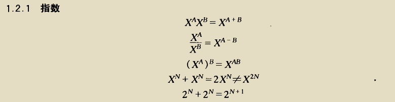 

### 1.2.2 对数

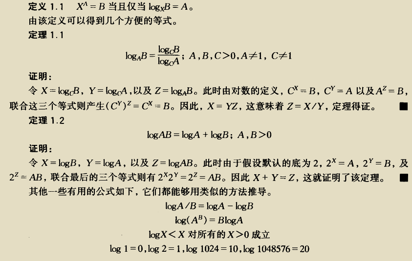 

### 1.2.3 级数

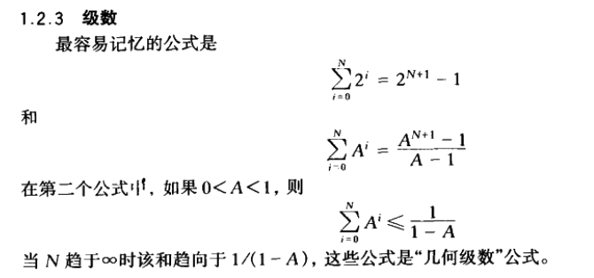 

### 1.2.4 模运算

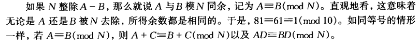 

### 1.2.5 证明的方法

归纳法证明：由归纳法进行的证明由两个标准的部分，第一步是证明基准情形(base case)，就是确定定理对于某个(某些)小的(通常是退化的)值得正确性，这一步几乎总是很简单的，接着，进行归纳假设(inductive hypothesis)，一般来说，它指的是假设定理对知道某个有限数k的所有的情况都是成立的，然后使用这个假设证明定理对下一个值(通常是k+1)也是成立的，至此定理得证(在k是有限的情形下)；

反证法证明：反证法证明是通过假设定理不成立，然后证明该假设导致某个已知的性质不成立，从而原假设是错误的；

## 1.3 递归简论

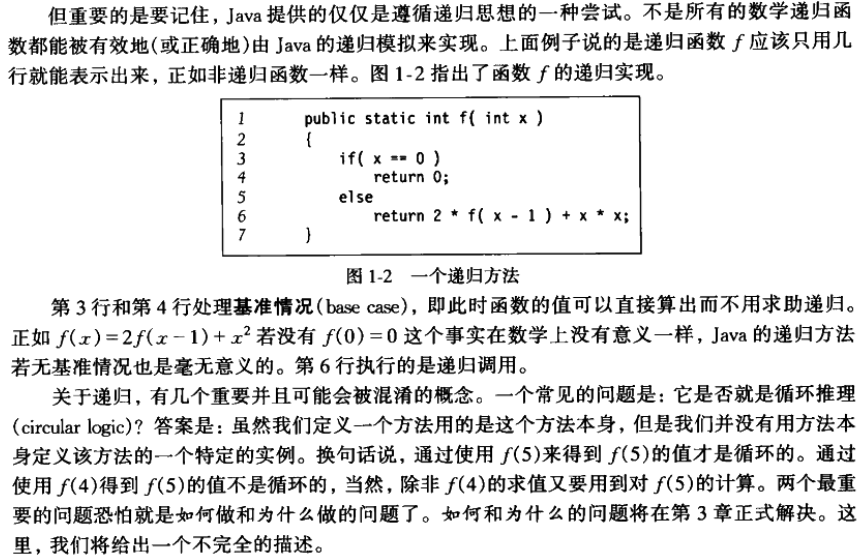 

跟踪挂起的函数调用(这些调用已经开始但是正等待着递归调用来完成)以及它们的变量的记录工作都是由计算机自动完成的，然而，重要的问题在于，递归调用将反复进行直到基准情形出现；

递归的基本准则：

1）基准情形(base case)：必须总要有某些基准的情形，它们不用递归就能求解；

2）不断推进(making progress)：对于那些要递归求解的情形，递归调用必须总能够朝着一个基准情形推进；

3）设计法则(design rule)，假设所有的递归调用都能运行；

4）合成效益法则(compound interest rule)，在求解一个问题的同一实例时，切勿在不同的递归调用中做重复性的工作；

## 1.4 实现泛型特性构件pre-Java5

### 1.4.1 使用Object表示泛型

### 1.4.2 基本类型的包装

### 1.4.3 使用接口类型表示泛型

### 1.4.4 数组类型的兼容性

## 1.5 利用Java5泛性实现泛型特性成分

### 1.5.1 简单的泛型类和接口

### 1.5.2 自动装箱/拆箱

Java5矫正了这种情形，如果一个int型量被传递到需要一个Interger对象的地方，那么，编译器将在幕后插入一个对Integer构造方法的调用，这就叫做自动装箱，而如果一个Integer对象被放到需要int型量的地方，则编译器将在幕后插入一个对intValue方法的调用，这就叫做自动拆箱，对于其他7对基本类型/包装类型，同样会发生类似的情形；

### 1.5.3 带有限制的通配符

### 1.5.4 泛型static方法

### 1.5.5 类型限界

```java
public static <AnyType extends Comparable <? super AnyType>>
```

### 1.5.6 类型擦除

### 1.5.7 对于泛型的限制

基本类型不能用做类型参数；

instanceof检测和类型转化工作只对原始类型进行；

在一个泛型类中，static方法和static域不可引用类的类型变量，因为在类型擦除后类型变量就不存在了，另外，由于实际上只存在一个原始类，因此static域在该类的诸泛型实例之间是共享的；

不能创建一个泛型类型的实例；

不能创建一个泛型的数组；

参数化类型的数组的实例化是非法的；

## 1.6 函数对象

# 第2章 算法分析

算法(algorithm)是为求解一个问题需要遵循的、被清楚指定的简单指令的集合；

## 2.1 数学基础

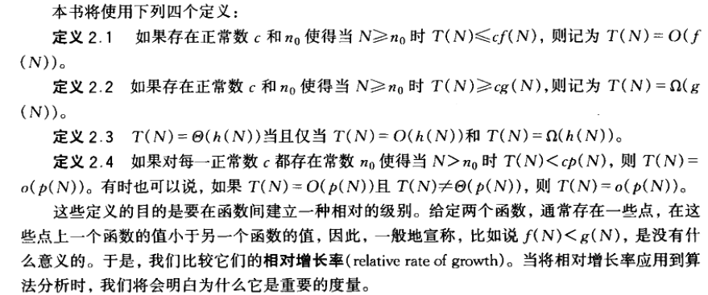 

## 2.2 模型

## 2.3 要分析的问题

偶尔也分析一个算法最好情形的性能，不过，通常没有什么意义，因为它不代表典型的行为，平均情形能常常反映典型的行为，而最坏情形的性能则代表对任何可能输入的性能的一种保证；

一般说来，若无相反的指定，则所需要的量是最坏情况的运行时间；

## 2.4 运行时间计算

### 2.4.1 一个简单的例子

### 2.4.2 一般法则

法则1：for循环

​	一个for循环的运行时间至多是该for循环内部那些语句(包括测试)的运行时间乘以迭代的次数；

法则2：嵌套的for循环

​	从里向外分析这些循环，从一组嵌套循环内部的一条语句总得运行时间为该语句的运行时间乘以该组所有for循环的大小的乘积；

法则3：顺序语句

​	将各个语句的运行时间求和即可(这意味着，其中的最大值就是所得的运行时间)；

法则4：if/else语句

​	一个if/else语句的运行时间从不超过判断的运行时间再加上S1和S2中运行时间长者的总的运行时间；

分析的基本策略是从内部(或最深层部分)向外展开工作的，如果有方法调用，那么要首先分析这些调用；

### 2.4.3 最大子序列和问题的求解

### 2.4.3 运行时间的对数

对数最常出现的规律可概括为下列一般法则：如果一个算法用常数时间(O(1))将问题的大小削减为其一部分(通产为1/2)，那么该算法就是O(logN)；另一方面，如果使用常数时间只是把问题减少一个常数的数据(如将问题较少1)，那么这种算法就是O(N)的；

折半查找(binary search)：折半查找提供了在O(logN)时间内的contains操作，但是所有其他操作(特别是insert操作)均需要O(N)时间，在数据是稳定(即不允许插入和删除操作)的应用中，这种操作可能是非常有用的，此时输入数据需要一次排序，但是此后的访问会很快；

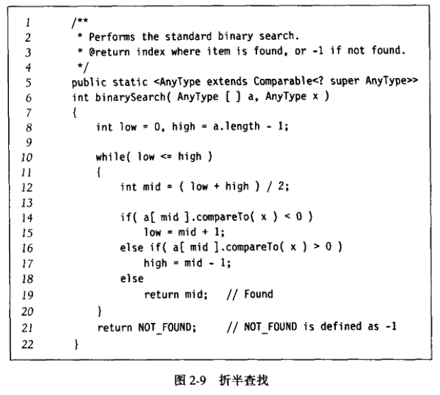 

欧几里得算法：计算最大公因数的欧几里得算法，两个整数的最大公因数(gdc)是同时整除二者的最大整数；

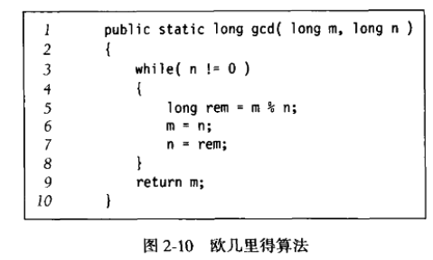 

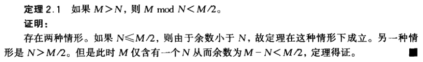 

幂运算：

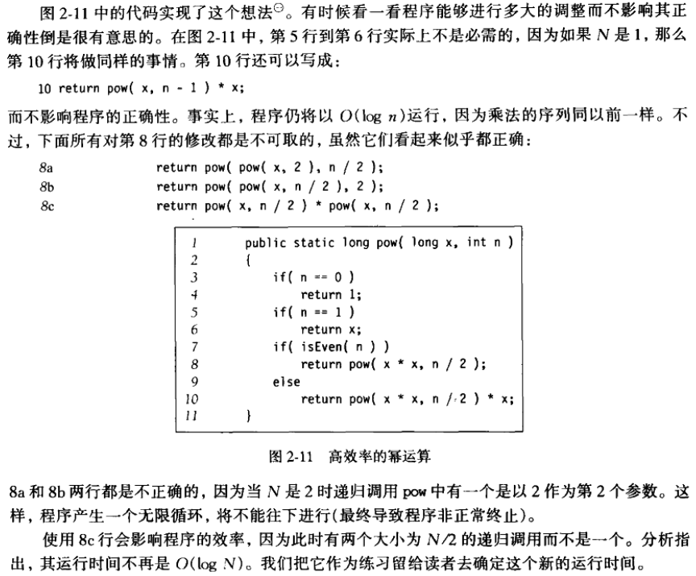 

### 2.4.5 验证你的分析

### 2.3.6 分析结果的准确性

对于大多数这类问题，平均情形的分析是及其复杂的(在很多情形下任然悬而未决)，而最坏情形的界尽管过分地悲观，但却是最好的已知解析结果；

# 第3章 表、栈和队列

## 3.1 抽象数据类型

抽象数据类型(abstract data type，ADT)是带有一组操作的一些对象的集合，抽象数据类型是数学的抽象：在ADT的定义中没有地方提到关于这组操作是如何实现的任何解释；

对于每种ADT并不存在什么法则告诉我们必须要有那些操作，这是一个设计决策，错误处理和结构调整(在适当的地方)一般也取决于程序的设计者；

## 3.2 表ADT

### 3.2.1 表的简单数组实现

### 3.2.2 简单链表

链表由一系列节点组成，这些节点不必在内存中相连，每一个节点含有表元素和到包含该元素后续元的节点的链(link)，我们称为之next链，最后一个单元的next链引用null；

## 3.3 Java Collections API中的表

### 3.3.1 Collection接口

### 3.3.2 Iterator接口

当直接使用Iterator(而不是通过一个增强的for循环间接使用)时，重要的是记住一个基本的法则：如果对正在被迭代的集合进行结构上的改变(即对集合使用add、remove或clear方法)，那么迭代器就不再合法(并且在其后使用迭代器时将会有ConcurrentModificationException异常被抛出)，这意味着，只有在需要立即使用一个迭代器的时候，我们才应该获取迭代器，然而，如果迭代器调用了它自己的remove方法，那么这个迭代器就任然是合法的；

### 3.3.3 List接口、ArrayList类和LinkedList类

### 3.3.4 例：remove方法对LinkedList类的使用

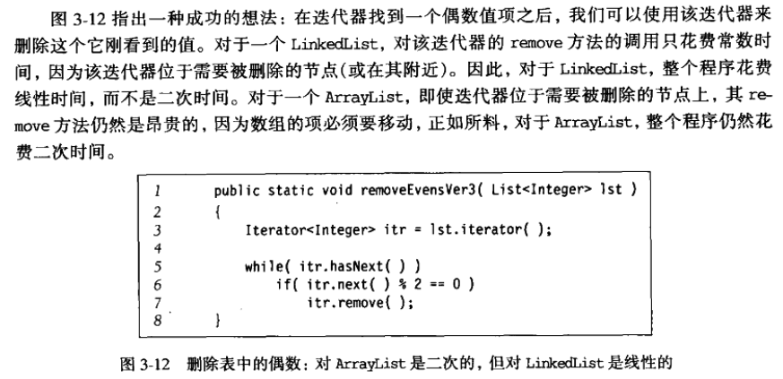 

### 3.3.5 关于ListIterator接口

## 3.4 ArrayList类的实现

### 3.4.1 基本类

### 3.4.2 迭代器、Java嵌套类和内部类

## 3.5 LinkedList类的实现

由于这些迭代器类存储"当前节点"的引用，并且终端标记是一个合理的位置，因此它对于在表的终端创建一个额外的节点来表示终端标记是有意义的，更进一步，我们还能够在表的前端创建一个额外的节点，逻辑上代表开始的标记，这些额外的节点有时候就叫做标记节点(sentinel node)，特别的，在前端的节点有时候也叫做头节点(header node)，而在末端的节点有时候也叫作尾节点(tail node)；

## 3.6 栈ADT

### 3.6.1 栈模型

栈(stack)是限制插入和删除只能在一个位置上进行的表，该位置是表的末端，叫做栈的顶(top)，栈有时也叫做LIFO(后进先出)表；

### 3.6.2 栈的实现

### 3.6.3 应用

平衡符号

后缀表达式

方法调用

## 3.7 队列ADT

队列(queue)也是表，然而，使用队列时插入在一端进行二删除则在另一端进行；

### 3.7.1 队列模型

### 3.7.2 队列的数组实现

3.7.3 队列的应用

# 第4章 树

## 4.1 预备知识

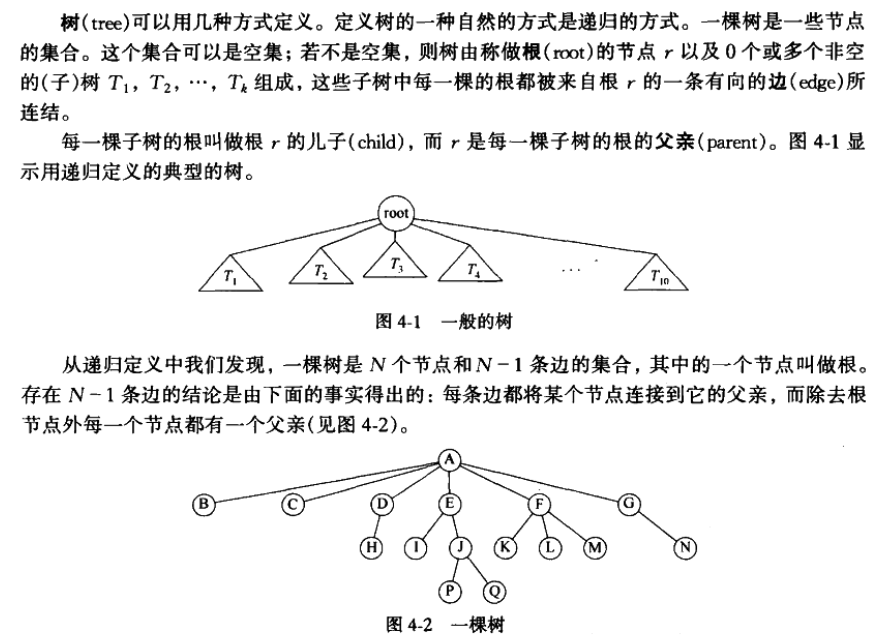 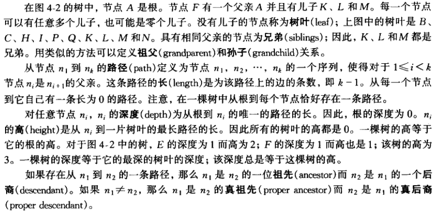 

### 4.1.1 树的实现

### 4.1.2 树的遍历及应用

先序遍历(preorder traversal)

后序遍历(postorder traversal)

中序遍历(inorder traversal)

## 4.2 二叉树

二叉树(binary tree)是一棵树，其中每个节点都不能有多于两个的儿子；

### 4.2.1 实现

4.2.2. 例子：表达式树

构造表达式树

## 4.3 查找树ADT——二叉查找树

使二叉树成为二叉查找树的性质是，对于树中的每个节点X，它的左子树中所有项的值小于X中的的项，而它的右子树中所有项的值大于X中的项；

### 4.3.1 contains方法

### 4.3.2 findMin方法和findMax方法

### 4.3.3 insert方法

### 4.3.4 remove方法

### 4.3.5 平均情况分析

## 4.4 AVL树

AVL(Adelson-Velskii和Landis)树是带有平衡条件(balance condition)的二叉查找树；这个平衡条件必须要容易保持，而且它保证树的深度是O(logN)；

一颗AVL树是其每个节点的左子树和右子树的高度最多差1的二叉查找树(空树的高度定义为-1)；

### 4.4.1 单旋转

### 4.4.2 双旋转

## 4.5 伸展树

伸展树(splay tree)，它保证从空树开始连续M次对树的操作最多花费O(MlogN)时间；

伸展树基于这样的事实：对于二叉查找树来说，每次操作最坏情形时间O(N)并不坏，只要它相对不常发生就行；

伸展树的基本想法是，当一个节点被访问后，它就要经过一系列AVL树的旋转被推到根上；

### 4.5.1 一个简单的想法(不能直接使用)

### 4.5.2 展开

## 4.6 再探树的遍历

中序遍历：首先处理左子树，然后是当前节点，最后处理右子树；

后序遍历：先处理两颗子树然后才能处理当前节点；

先序遍历：当前节点在其儿子节点之前处理；

层序遍历：层序遍历与其他类型的遍历不同的地方在于它不是递归地执行的，它用到队列，而不使用递归所默认的栈；

## 4.7 B树

## 4.8 标准库中的集合与映射

### 4.8.1 关于Set接口

### 4.8.2 关于Map接口

### 4.8.3 TreeSet和TreeMap类的实现

### 4.8.4 使用多个映射的实例

# 第5章 散列


# 第6章 优先队列(堆)

# 第7章 排序

# 第8章 不想叫集类

# 第9章 图论算法

# 第10章 算法设计技巧

# 第11章 摊还分析

# 第12章 高级数据结构及其实现

# 数据结构导论(20200913-)

## 第一章 概论

### 1.1 引言

### 1.2 基本概念和术语

#### 1.2.1 数据、数据元素和数据项

数据：所有被计算机存储、处理的对象；

数据元素：数据的基本单位，在程序中作为一个整体而加以考虑和处理；数据元素是运算的基本单位，通常具有完整确定的实际意义，常简称为元素；

数据项：数据项时候数据的不可分割的最小标识单位，一般情况下，数据元素由数据项组成，在数据库中数据项又称为字段或域；

从宏观上看，数据、数据元素和数据项实际上反映了数据组织的三个层次，数据可由若干个数据元素组成，而数据元素又可由若干个数据项做成；

数据结构是相互之间存在一种或多种特定关系的数据元素的集合，它包括数据的逻辑结构、数据的存储结构和数据的基本运算；

#### 1.2.2 数据的逻辑结构

数据的逻辑结构是指元素之间的逻辑关系，所谓逻辑关系是指数据元素之间的关联方式或"邻接关系"；

数据元素之间逻辑关系的整体称为逻辑结构；

四类基本逻辑结构：集合、线性结构、树形结构、图；

数据的逻辑结构只是一种数学模型，体现了数据的组织方式，要在计算机中实现逻辑结构，还依赖它在计算机中的存储结构；

#### 1.2.3 数据的存储结构

数据的逻辑结构在计算机中的实现称为数据的存储结构(或物理结构)；

一般情况下，一个存储结构包含以下两个部分：

1. 存储数据元素
2. 数据元素之间的关联方式

表示数据元素之间的关联方式主要有顺序存储方式和链式存储方式；

顺序存储方式是指所有存储结点存放在一个连续的存储区里，利用结点在存储器中的相对位置来表示数据元素之间的逻辑关系；

链式存储方式是指每个存储结点除了含有一个数据元素外，还包含指针，每个指针指向一个与本结点有逻辑关系的结点，用指针表示数据元素之间的逻辑关系；

除了上述两种存储之外，还有索引存储方式和散列存储方式；

#### 1.2.4 运算

运算是指在某种逻辑结构上施加的操作，即对逻辑结构的加工；

### 1.3 算法及描述

运算的实现是指该运算的算法；一个算法规定了求解给定问题所需的处理步骤及其执行顺序，使得给定问题能在有限时间内被求解；

### 1.4 算法分析

通常评价算法好坏的因素包括以下几个方面：

正确性、易读性、健壮性、时空性；

#### 1.4.1 时间复杂度

O(1) < O( logN) < O(N) < O(N²) < O(N³) <O(C^n)

通常可以用最坏时间复杂度和平均时间复杂度来度量算法的性能：

最坏时间复杂度是指，对相同输入数据量的不同输入数据，算法时间用量的最大值；

平均时间复杂度是指，对所有相同输入数据量的各种不同输入数据，算法时间用量的平均值；

#### 1.4.2 空间复杂度

空间复杂度是对一个算法在运行过程中临时占用存储空间大小的度量，一个算法在执行期间所需要的存储空间量应包括以下三个部分；

1. 程序代码所占用的空间
2. 输入数据所占用的空间
3. 辅助变量所占用的空间

算法在执行过程中，输入数据所占用的空间是由问题决定的，它不随算法的不同改变；程序代码所占用的空间对不同的算法来说也不会有数量级的差别；辅助变量占用的空间则由算法决定；在估算算法空间复杂度时，一般只需分析辅助变量所占用的空间；

### 1.5 本书的组织结构

### 1.6 小结

## 第二章 线性表

### 2.1 线性表的基本概念

### 2.2 线性表的顺序存储

#### 2.2.1 线性表顺序存储的类型定义

#### 2.2.2 线性表的基本运算在顺序表上的实现

#### 2.2.3 顺序表实现算法的分析

### 2.3 线性表的链接存储

#### 2.3.1 单链表的类型定义

#### 2.3.2 线性表的基本运算在单链表上的实现

### 2.4 其他运算在单链表上的实现

#### 2.4.1 建表

#### 2.4.2 删除重复结点

### 2.5 其他链表

#### 2.5.1 循环链表

#### 2.5.2 双向循环链表

### 2.6 顺序是先与链接实现的比较

### 2.7 小结

## 第三章 栈、队列和数组

### 3.1 栈

#### 3.1.1 栈的基本概念

#### 3.1.2 栈的顺序实现

#### 3.1.3 栈的链接实现

#### 3.1.4 栈的简单应用和递归

### 3.2 队列

#### 3.2.1 队列的基本概念

#### 3.2.2 队列的顺序实现

#### 3.2.3 队列的链接实现

#### 3.2.4 队列应用

### 3.3 数组

#### 3.3.1 数组的逻辑结构和基本运算

#### 3.3.2 数组的存储结构

#### 3.3.3 矩阵的压缩存储

1. 特殊矩阵
2. 稀疏矩阵

### 3.4 应用举例

### 3.5 小结

## 第四章 树和二叉树

### 4.1 树的基本概念

树形结构的定义是递归的；

#### 4.1.2 树的相关术语

结点的度：树上任一结点所拥有的子树的数目称为该结点的度；

叶子：度为0的结点称为叶子或终端结点；

树的度：一棵树中所有结点的度的最大值称为该树的度；

结点的层次：从根开始算起，根的层次为1,其余结点的层次为其双亲的层次加1；

树的高度：一棵树中所有结点层次数的最大值称为该树的高度或深度；

### 4.2 二叉树

#### 4.2.1 二叉树的基本概念

#### 4.2.2 二叉树的性质

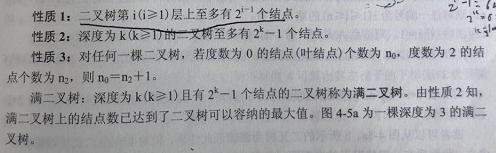 

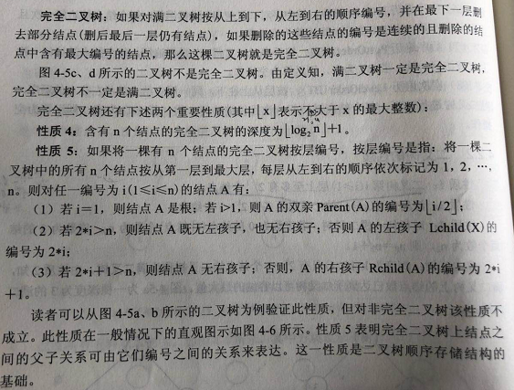 

### 4.3 二叉树的存储结构

#### 4.3.1 二叉树的顺序存储结构

由二叉树的性质5可知，如果对任一完全二叉树上的所有结点按层编号，则结点编号之间的关系可以准确反映结点之间的逻辑关系，因此，对于任何完全二叉树来说，可以采用以编号作为数组的下标的方法将结点存入一维数组中，也就是将编号为i的结点存入一维数组的以i为下标的数组元素中；

如果需要顺序存储的非完全二叉树，首先必须用某种方法将其转化为完全二叉树，为此可增设若干个虚拟结点；但这种方法的缺点是造成了空间的浪费；

#### 4.3.2 二叉树的链式存储结构

二叉树有不同的链式存储结构，其中最常见的是二叉链表与三叉链表；

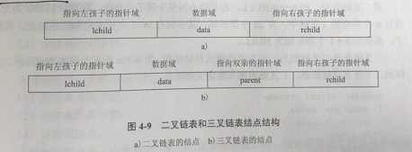 

### 4.4 二叉树的遍历

#### 4.4.1 二叉树遍历的递归实现

二叉树的遍历是指按某种次序访问二叉树上的所有结点，使每个结点都访问一次且仅被访问一次；

1. 先序(根)遍历
2. 中序(根)遍历
3. 后序(根)遍历

#### 4.4.2 二叉树的层次遍历

#### 4.2.3 二叉树遍历的非递归实现


# 算法(第4版)(20200914-)

## 第1章 基础

### 1.1 基础编程模型

#### 1.1.1 Java程序的基本结构

#### 1.1.2 原始数据类型与表达式

##### 1.1.2.1 表达式

##### 1.1.2.2 类型转换

##### 1.1.2.3 比较

##### 1.1.2.4 其他原始类型

#### 1.1.3 语句

##### 1.1.3.1 声明语句

##### 1.1.3.2 赋值语句

##### 1.1.3.3 条件语句

##### 1.1.3.4 循环语句

##### 1.1.3.5 break与continue语句

#### 1.1.4 简便记忆

##### 1.1.4.1 声明并初始化

##### 1.1.4.2 隐式赋值

##### 1.1.4.3 单语句代码段

##### 1.1.4.4 for语句

#### 1.1.5 数组

##### 1.1.5.1 创建并初始化数组

##### 1.1.5.2 简化写法

##### 1.1.5.3 使用数组

##### 1.1.5.4 起别名

##### 1.1.5.5 二维数组

#### 1.1.6 静态方法

##### 1.1.6.1 静态方法

##### 1.1.6.2 调用静态方法

##### 1.1.6.3 方法的性质

##### 1.1.6.4 递归

编写递归代码最重要的有以下三点：

- 递归总有一个最简单的情况，方法的第一条语句是一个包含return的条件语句；
- 递归调用总是去尝试解决一个规模更小的子问题，这样递归才能收敛到最简单的情况；
- 递归调用的父问题和尝试解决的子问题之间不应该有交集；

##### 1.1.6.5 基础编程模型

##### 1.1.6.6 模块化编程

##### 1.1.6.7 单元测试

##### 1.1.6.8 外部库

#### 1.1.7 API

##### 1.1.7.1 举例

##### 1.1.7.2 Java库

##### 1.1.7.3 我们的标准库

##### 1.1.7.4 你自己编写的库

#### 1.1.8 字符串

##### 1.1.8.1 字符串拼接

##### 1.1.8.2 类型转换

##### 1.1.8.3 命令行参数

#### 1.1.9 输入输出

##### 1.1.9.1 命令和参数

##### 1.1.9.2 标准输出

##### 1.1.9.3 格式化输出

##### 1.1.9.4 标准输入

##### 1.1.9.5 重定向与管道

##### 1.1.9.6 基于文件的输入输出

##### 1.1.9.7 标准绘图库(基本方法)

##### 1.1.9.8 标准绘图库(控制方法)

#### 1.1.10 二分查找

##### 1.1.10.1 二分查找

##### 1.1.10.2 开发用例

##### 1.1.10.3 白名单过滤

##### 1.1.10.4 性能

#### 1.1.11 展望

### 1.2 数据抽象

抽象数据类型(ADT)是一种能够对使用者隐藏数据表示的数据类型，用Java类来实现抽象数据类型和用一组静态方法实现一个函数库并没有什么不同，抽象数据类型的主要不同之处在于它将数据和函数的实现关联，并将数据的表示方法隐藏起来；

#### 1.2.1 使用抽象数据类型

##### 1.2.1.1 抽象数据类型的API

##### 1.2.1.2 继承的方法

##### 1.2.1.3 用例代码

##### 1.2.1.4 对象

API的目的是将调用和实现分离，除了API中给出的信息，调用者不需要知道实现的其他细节，而实现也不应考虑特殊的应用场景；

所有对象都有三大重要特性：状态、标识和行为，对象的状态即数据类型中的值，对象的标识份能够将一个对象区别于另一个对象，可以认为对象的标识就是它在内存中的位置，对象的行为就是数据类型的操作；

##### 1.2.1.5 创建对象

每当用例调用了new()，系统都会：

1. 为新的对象分配内存空间；
2. 调用构造函数初始化对象中的值；
3. 返回该对象的一个引用；

##### 1.2.1.6 调用实例方法

##### 1.2.1.7 使用对象

##### 1.2.1.8 赋值语句

##### 1.2.1.9 将对象作为参数

Java将参数值得一个副本从调用端传递给方法，这种方式称为按值传递，这种方式的一个重要后果是方法无法改变调用端变量的值，对于原始数据类型来说，这种策略正是我们所期待的(两个变量互相独立)，但每当使用引用类型作为参数时我们创建的都是别名，所以就必须小心，换句话说，这种约定将会传递引用的值(复制引用)，也就是传递对象的引用；

##### 1.2.1.10 将对象作为返回值

##### 1.2.1.11 数组也是对象

在Java中，所有非原始数据类型的值都是对象，也就是说，数组也是对象；

##### 1.2.1.12 对象的数组

数据类型指的是一组值和一组对值的操作的集合；

#### 1.2.2 抽象数据类型举例

##### 1.2.2.1 几何对象

##### 1.2.2.2 信息处理

##### 1.2.2.3 字符串

##### 1.2.2.4 再谈输入输出

#### 1.2.3 抽象数据类型的实现

##### 1.2.3.1 实例变量

##### 1.2.3.2 构造函数

##### 1.2.3.3 实例方法

##### 1.2.3.4 作用域

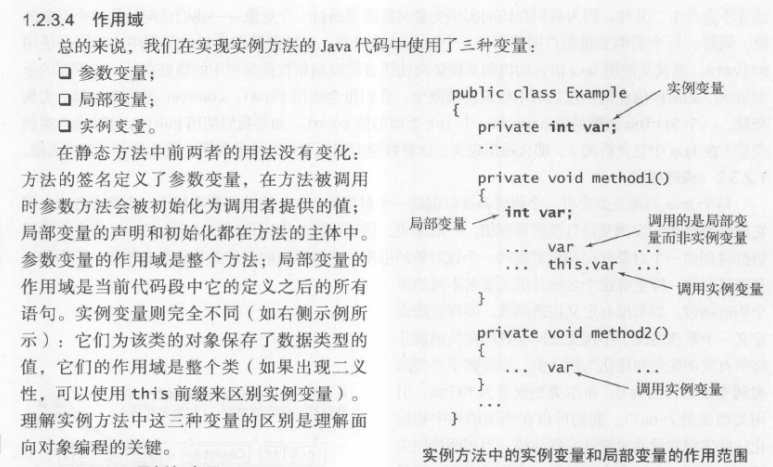 

##### 1.2.3.5 API、用例与实现

#### 1.2.4 更多抽象数据类型的实现

##### 1.2.4.1 日期

##### 1.2.4.2 维护多个实现

##### 1.2.4.3 累加器

##### 1.2.4.4 可视化累加器

#### 1.2.5 数据类型的设计

抽象数据类型是一种向用例隐藏内部表示的数据类型；

##### 1.2.5.1 封装

我们坚持将API作为用例和实现之间唯一的依赖点来做到这一点，并不需要知道一个数据类型是如何实现的才能使用它，实现数据类型也应该假设使用者除了API什么也不知道，封装是获得所有这些优势的关键；

##### 1.2.5.2 设计API

只为用例提供它们所需要的，仅此而已；

##### 1.2.5.3 算法与抽象数据类型

##### 1.2.5.4 接口继承

##### 1.2.5.5 实现继承

##### 1.2.5.6 字符串表示的习惯

##### 1.2.5.7 封装类型

##### 1.2.5.8 等价性

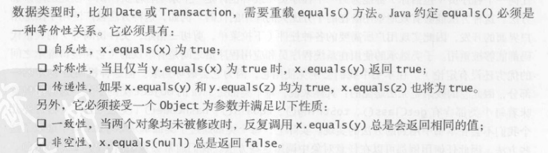 

##### 1.2.5.9 内存管理

##### 1.2.5.10 不可变性

如果一个应用类型的实例变量含有修饰符final，该实例变量的值(某个对象的引用)就永远无法改变了，它将永远指向同一个对象，但对象的值本身任然是可变的；

##### 1.2.5.11 契约式设计

##### 1.2.5.12 异常与错误

##### 1.2.5.13 断言

##### 1.2.5.14 小结

### 1.3 背包、队列和栈

#### 1.3.1 API

##### 1.3.1.1 泛型

##### 1.3.1.2 自动装箱

##### 1.3.1.3 可迭代的集合类型

##### 1.3.1.4 背包

##### 1.3.1.5 先进先出队列

##### 1.3.1.6 下压栈

##### 1.3.1.7 算术表达式求值

#### 1.3.2 集合类数据类型的实现

##### 1.3.2.1 定容栈

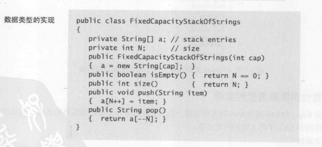 

##### 1.3.2.2 泛型

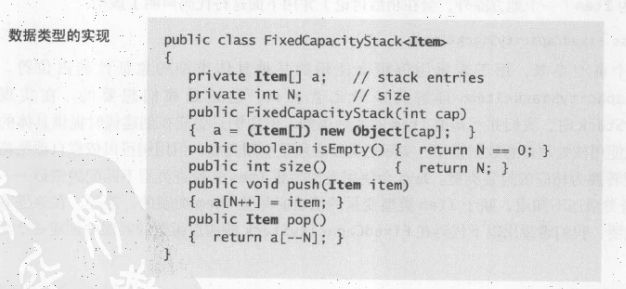 

##### 1.3.2.3 调整数组大小

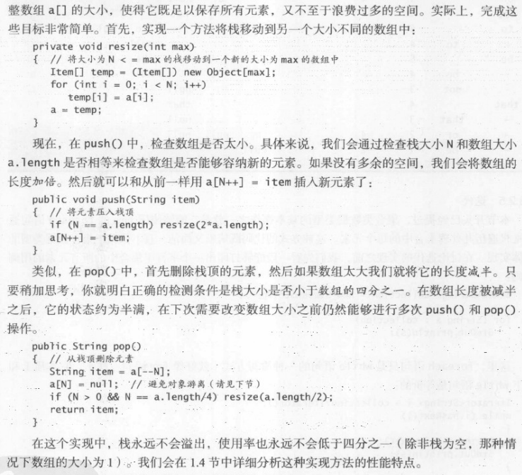

##### 1.3.2.4 对象游离

##### 1.3.2.5 迭代

#### 1.3.3 链表

链表是一种递归的数据结构，它或者为空(null)，或者是指向一个结点(node)的引用，该结点含有一个泛型的元素和一个指向另一条链表的引用；

##### 1.3.3.1 结点记录

##### 1.3.3.2 构造链表

1.3.3.3 在表头插入结点

1.3.3.4 在表头删除结点

头插法

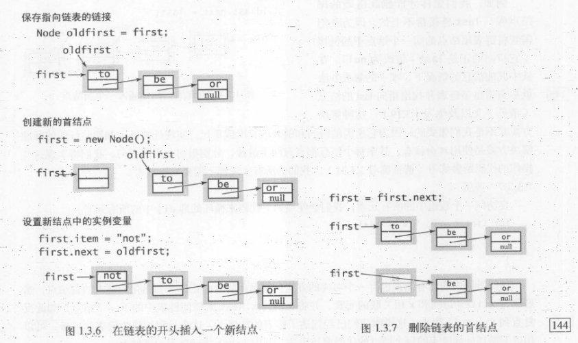 

##### 1.3.3.5 在表尾插入结点

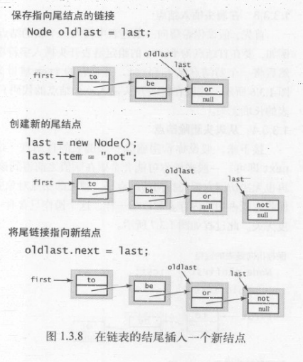 

##### 1.3.3.6 其他位置的插入和删除操作

##### 1.3.3.7 遍历

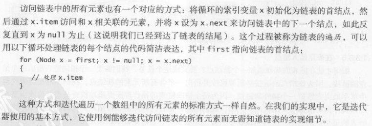 

##### 1.3.3.8 栈的实现

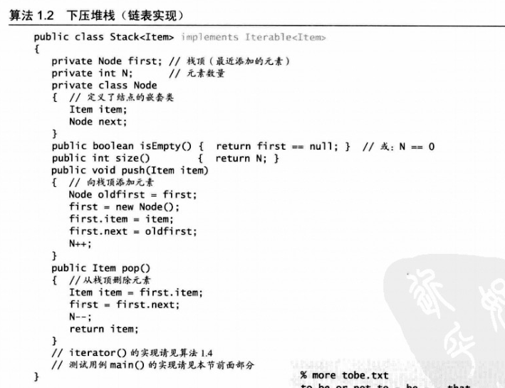 

##### 1.3.3.9 队列的实现

我们用链表达到了最优设计目标：可以处理任意类型的数据，所需的空间总是和集合的大小成正比，操作所需的时间总是和集合的大小无关；

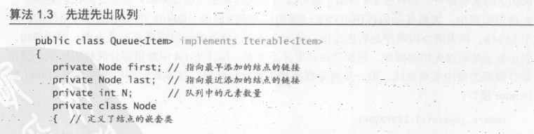 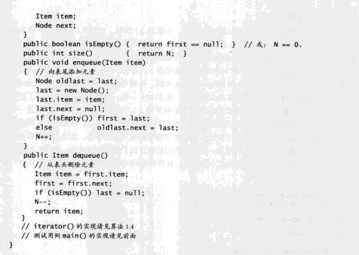 

##### 1.3.3.10 背包的实现

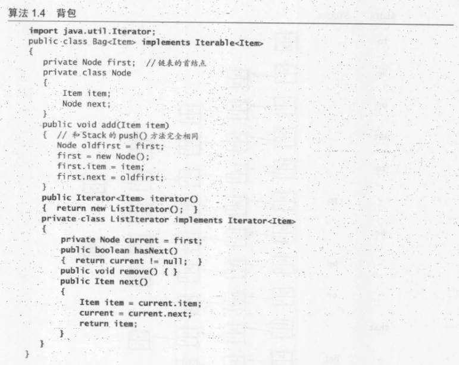 

#### 1.3.4 综述

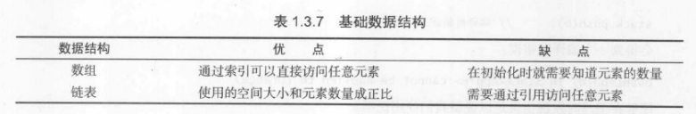 

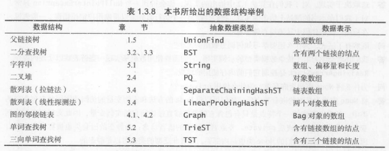 

### 1.4 算法分析

#### 1.4.1 科学方法

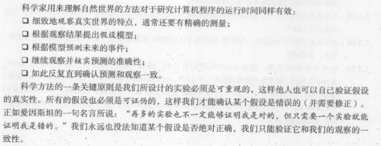 

#### 1.4.2 观察

##### 1.4.2.1 举例

##### 1.4.2.2 计时器

##### 1.4.2.3 实验数据的分析

#### 1.4.3 数学模型

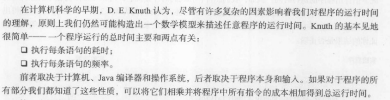 

##### 1.4.3.1 近似

##### 1.4.3.2 近似运行时间

##### 1.4.3.3 对增长数量级的猜想

##### 1.4.3.4 算法的分析

##### 1.4.3.5 成本模型

我们使用了一个成本模型来评估算法的性质，这个模型定义了我们所研究的算法中的基本操作；

##### 1.4.3.6 总结

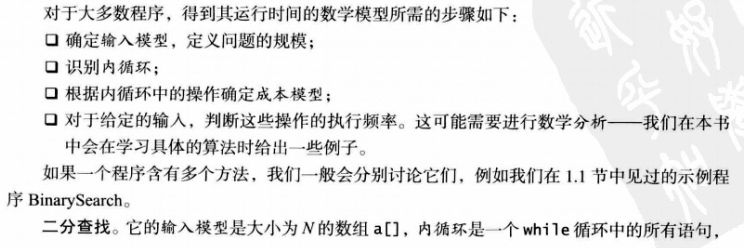 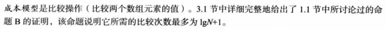 

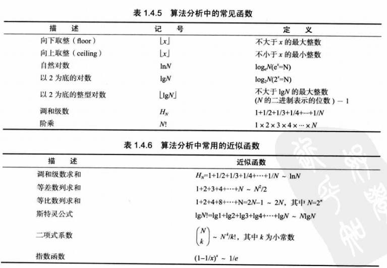 

#### 1.4.4 增长数量级的分类

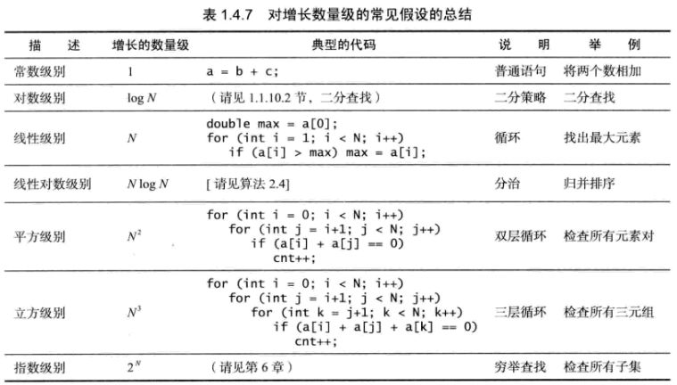 

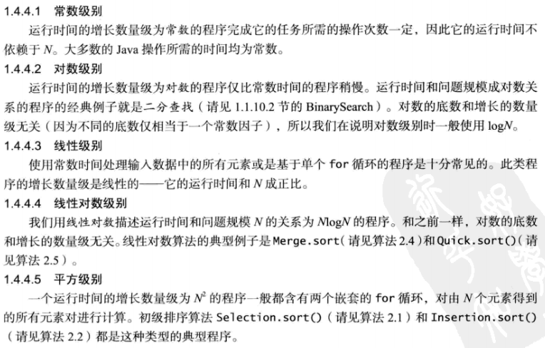 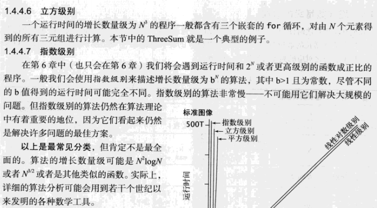 

##### 1.4.4.1 常数级别

##### 1.4.4.2 对数级别

##### 1.4.4.3 线性级别

##### 1.4.4.4 线性对数级别

##### 1.4.4.5 平方级别

##### 1.4.4.6 立方级别

#### 1.4.5 设计更快的算法

1.4.5.1 热身运动2-sum

##### 1.4.5.2 3-sum问题的快速算法


#### 1.4.6 倍率实验

#### 1.4.7 注意事项

#### 1.4.8 处理对于输入的依赖

#### 1.4.9 内存

#### 1.4.10 展望

## 第2章 排序

## 第3章 查找

## 第4章 图

## 第5章 字符串

## 第6章 背景

