# 数据结构与算法基础(青岛大学-王卓)(20200906-20201018)

## 第1章绪论(1)

### 1.1 数据结构的研究内容

### 1.2 基本概念和术语

### 1.3 抽象数据类型的表示与实现

### 1.4 算法和算法分析

## 第2章 线性表1 

### 2.1 线性表的定义和特点

### 2.2 案例引入

### 2.3 线性的类型定义

### 2.4 线性表的顺序表示和实现

### 2.5 线性表的链式表示和实现

### 2.6 顺序表和链表的比较

### 2.7 线性表的应用

### 2.8 案例分析与实现

双向链表

双向链表的插入操作

双向链表的删除操作

单链表、循环链表、双向链表的比较

 

顺序表和链表的比较

 

 

线性表的合并

有序表的合并

## 第3章 栈和队列

### 3.3.1 栈的抽象数据类型定义

### 3.3.2 栈的顺序表示和实现

### 3.3.3 链表表示和实现

### 3.4 栈和递归

 

 

 

  

### 3.5.1 队列的类型定义

### 3.5.2 队列的顺序表示和实现

## 第4章 串、数组和广义表

### 4.1 串、数组和广义表-串的定义

### 4.2 串、数组和广义表-案例引入

### 4.3 串、数组和广义表-串的类型定义、存储结构及其运算

### 4.4 串、数组和广义表-数组

数组的顺序存储

对称矩阵压缩存储

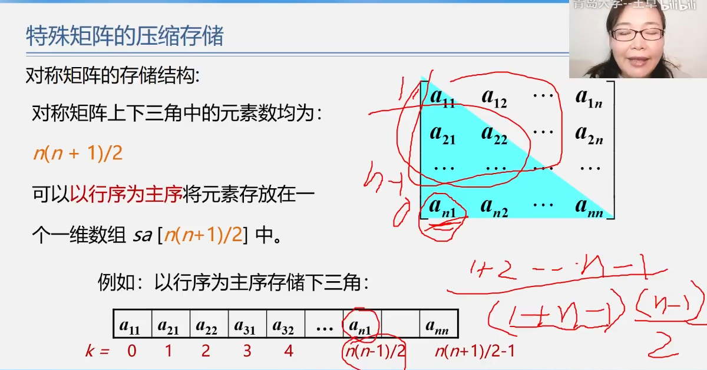 

三角矩阵、对角

  

稀疏矩阵压缩存储

  

### 4.5 串、数组和广义表-广义表

 

### 4.6 串、数组和广义表-案例分析与实现

### 4.7 串、数组和广义表-小结

## 第5章 树和二叉树

### 5.1 树和二叉树的定义

 

 

### 5.2 案例引入

### 5.3 树和二叉树的抽象数据类型定义

### 5.4 二叉树的性质和存储结构

 

 

 

 

 

 

 

 

 

### 5.5 遍历二叉树和线索二叉树

#### 二叉树的递归遍历算法及分析

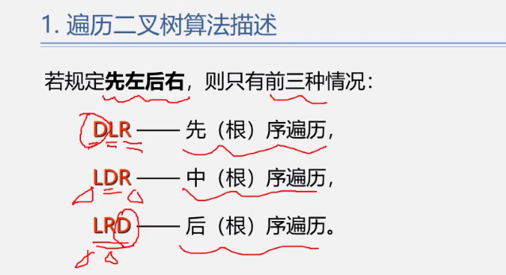 

 

 

 

#### 二叉树的遍历算法-中序非递归算法

 

#### 二叉树的遍历算法-层次遍历算法

 

 

#### 二叉树遍历算法应用1-建立二叉树算法

 

#### 二叉树遍历算法应用2-复制、求结点数、求叶子结点数

 

 

 

 

 

 

### 5.6 树和森林

#### 树的存储结构1-双亲表示法

 

树的存储结构2-孩子链表

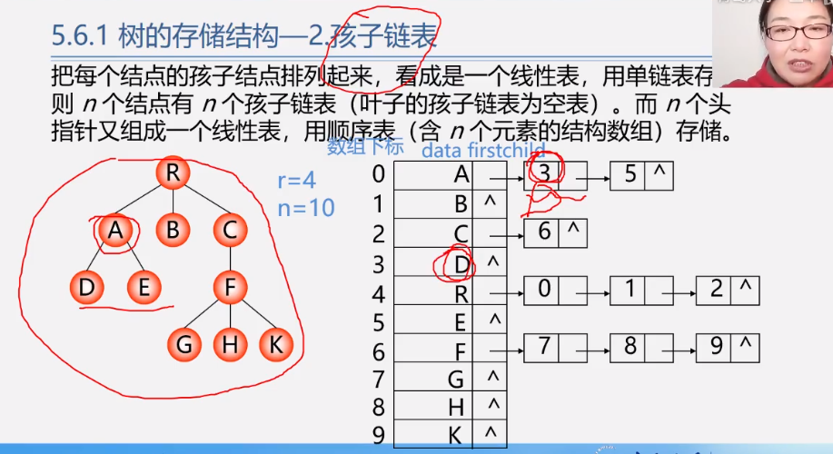 

 

#### 树的存储结构3-孩子兄弟表示法

 

 

 

 

 

 

 

  

 

 

### 5.7 哈夫曼树及其应用

 

  

 

 

 

### 5.8 案例分析与实现

## 第6章 图

### 6.1 图的定义和基本术语

 

 

 

 

 

 

 

 

### 6.2 案例引入

 

### 6.3 图的类型定义

   

### 6.4 图的存储结构

 

 

 

 

 

 

 

 

 

 

 

 

 

 

 

 

 

 

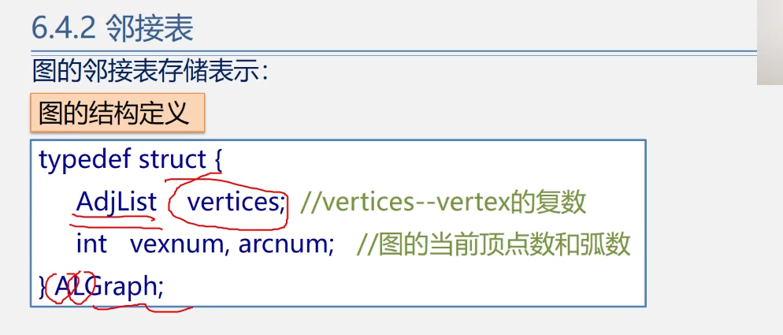 

 

 

 

 

 

 

 

 

### 6.5 图的遍历

 

 

 

 

 

 

 

 

 

 

 

 

### 6.6 图的应用

 

 

 

 

 

 

 

 

 

 

 

 

 

 

 

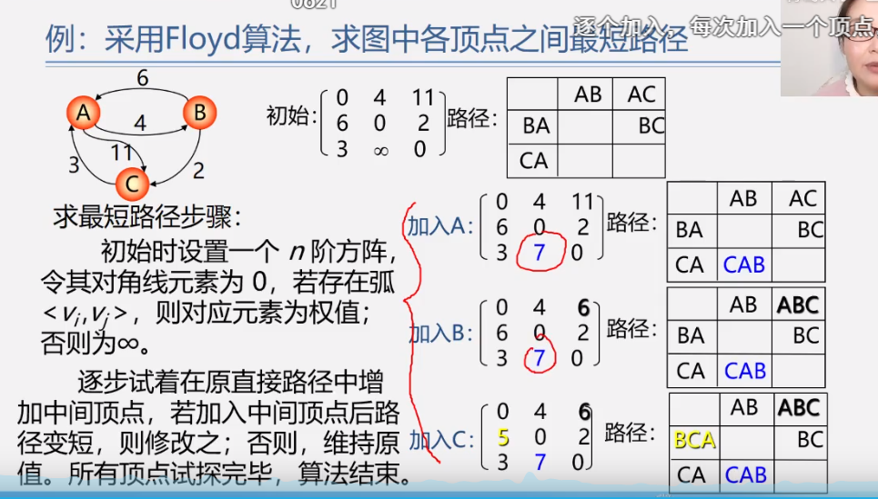 

 

 

 

 

 

 

 

 

 

 

 

 

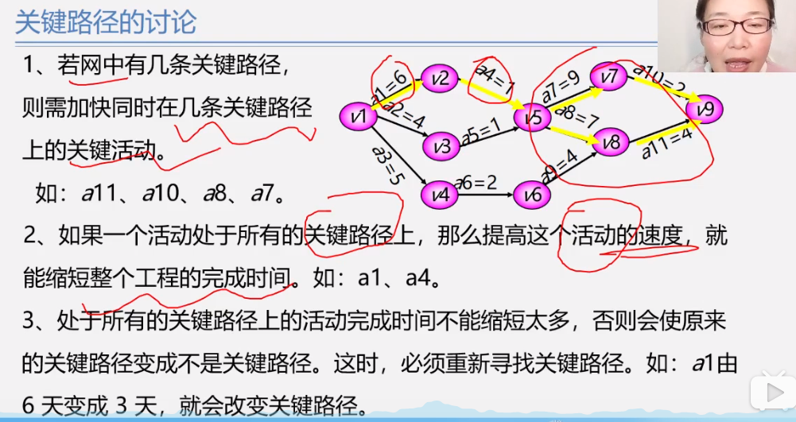

### 6.7 案例分析与实现

## 第7章 查找

 

### 7.1 查找的基本概念

 

 

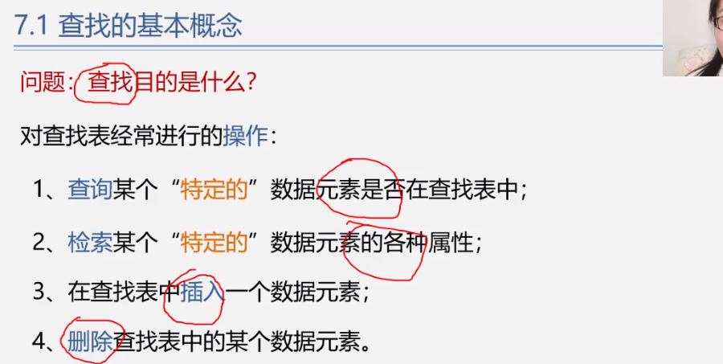 

 

 

 

### 7.2 线性表的查找

#### 7.2.1 顺序查找(线性查找)

 

 

 

 

 

 

 

 

 

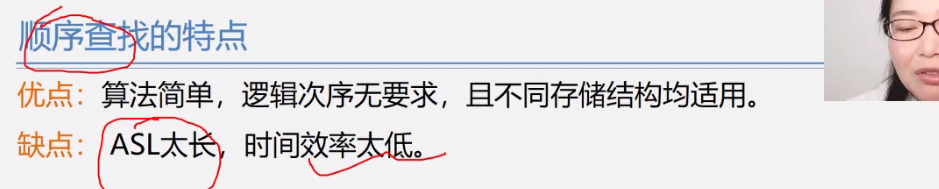 

#### 7.2.2 折半查找(二分或对分查找)

##### 7.2.2.1 折半查找算法

 

 

 

##### 7.2.2.2 折半查找算法分析

 

 

 

 

#### 7.2.3 分块查找

##### 7.2.3.1 分块查找算法

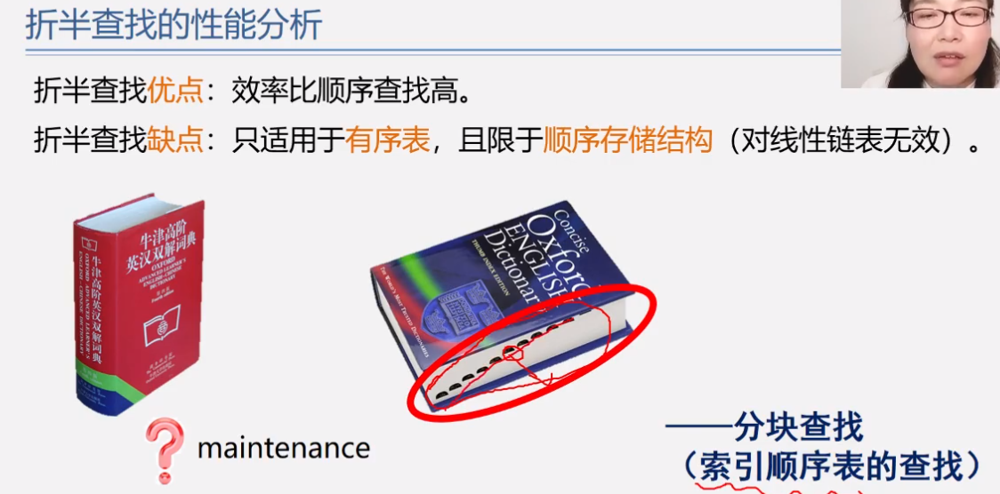 

 

##### 7.2.3.2 分块查找算法分析及比较

 

 

### 7.3 树表的查找

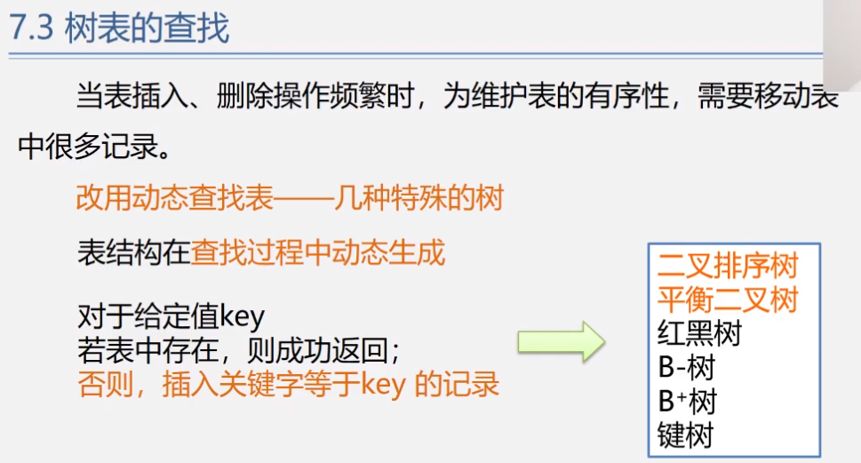 

#### 7.3.1 二叉排序树

##### 7.3.1.1 二叉排序树-定义 

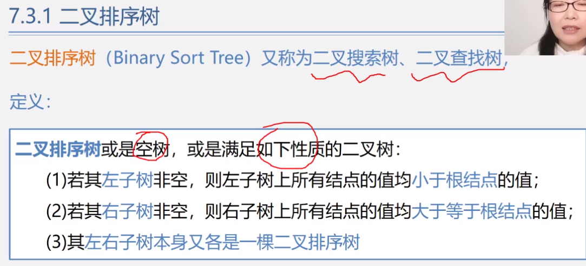 

 

##### 7.3.1.2 二叉排序树查找-递归算法

 

 

 

 

##### 7.3.1.3 二叉排序树-查找算法分析

 

 

 

 

##### 7.3.1.4 二叉排序树的操作-插入和生成

 

 

 

 

##### 7.3.1.5 二叉排序树的操作-删除

 

 

 

 

 

 

 

#### 7.3.2 平衡二叉树

##### 7.3.2.1 平衡二叉树-定义

 

 

 

##### 7.3.2.2 平衡二叉树-平衡调整方法

 

 

 

##### 7.3.2.3 平衡二叉树-四种类型的调整

 

 

 

 

 

 

 

 

 

### 7.4 散列表的查找

##### 7.4.1 散列表的查找-散列表的基本概念

 

 

 

 

 

##### 7.4.2散列表的查找-散列表函数的构造

 

 

 

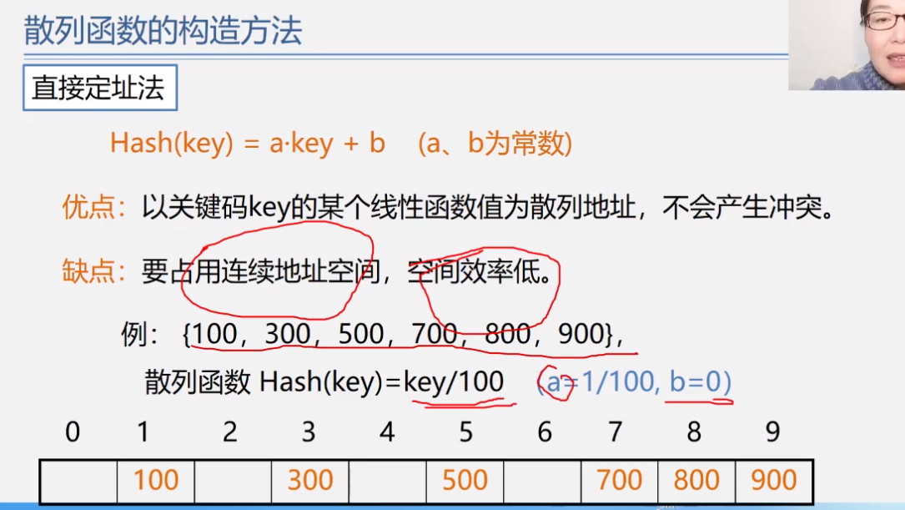 

 

##### 7.4.3 散列表的查找-处理冲突方法

 

###### 7.4.3.1 处理冲突方法1-开地址法1-线性探测发

 

 

###### 7.4.3.2 处理冲突方法2-开地址法2-二次探测发、伪随机探测法

 

###### 7.4.3.3 处理冲突方法3-链地址法

 

 

 

##### 7.4.4 散列表的查找-散列表的查找及性能分析

 

 

## 第8章 排序

### 8.1 基本概念和排序方法概述

 

 

 

 

 

 

 

 

 

 

 

 

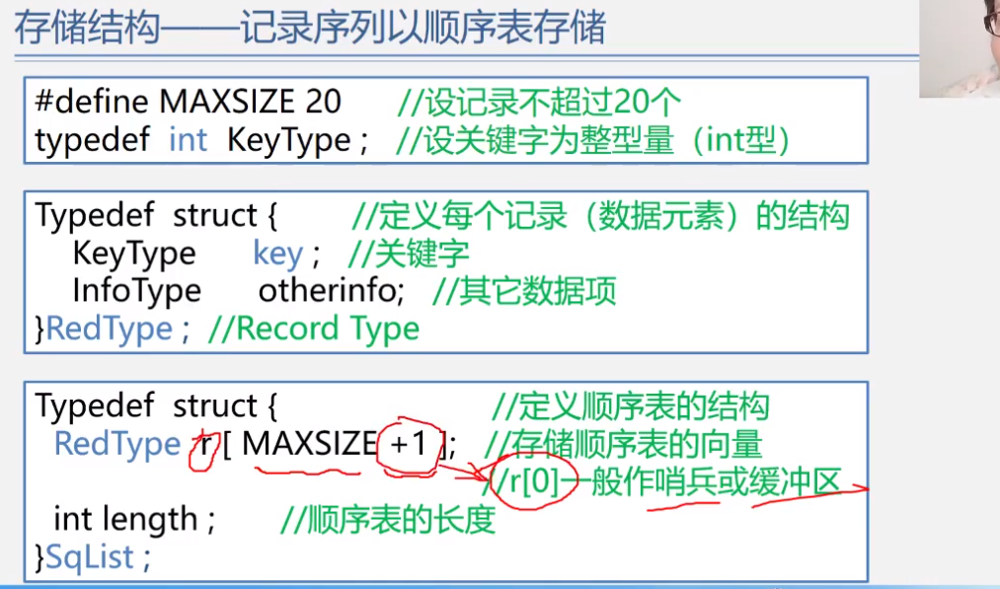 

### 8.2 插入排序

#### 8.2.1 插入排序1-直接插入排序

 

 

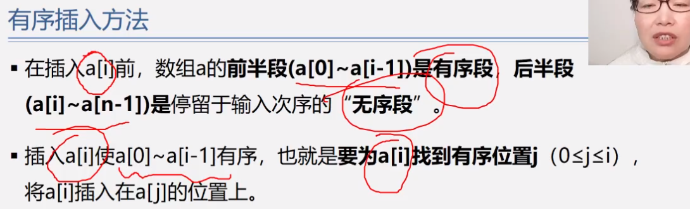 

 

 

 

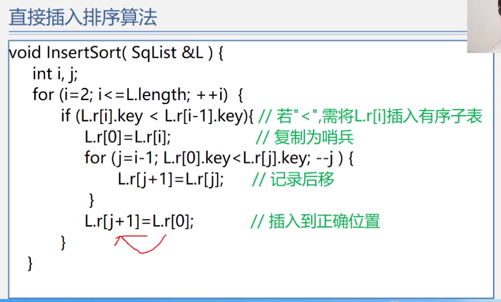 

 

 

 

#### 8.2.2 插入排序2-折半插入排序

 

 

 

 

#### 8.2.3 插入排序3-希尔排序

 

 

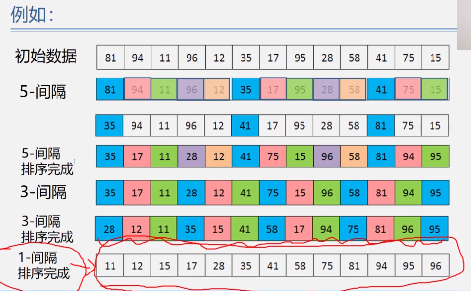 

 

 

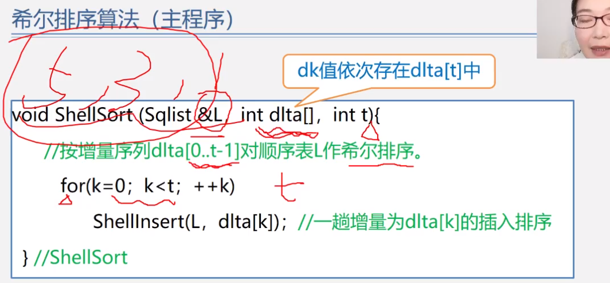 

 

 

 

### 8.3 交换排序

#### 8.3.1 交换排序1-冒泡排序

 

 

 

 

 

 

 

 

#### 8.3.2 交换排序2-快速排序1

 

 

 

 

 

 

#### 8.3.3 交换排序3-快速排序2-快速排序算法分析

 

 

 

### 8.4 选择排序

#### 8.4.1 选择排序1-简单选择排序

 

 

 

 

#### 8.4.2 选择排序2-堆排序1

 

 

 

 

#### 8.4.3 选择排序2-堆排序2-堆调整

 

 

 

#### 8.4.4 选择排序2-堆排序3-堆建立

 

 

 

#### 8.4.5 选择排序2-堆排序4-堆排序算法及分析

 

 

 

 

### 8.5 归并排序

 

 

 

 

### 8.6 基数排序

 

 

 

 

 

 

 

### 8.7 外部排序

### 8.8 各种排序比较

 

 

 

 

 

